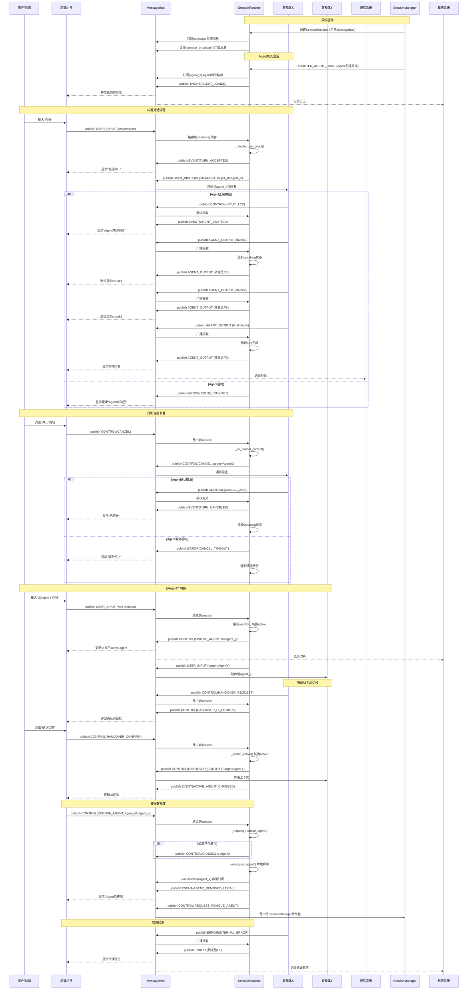

# SessionRuntime 职责说明书

## 流程说明：

## 消息类型总结表格

| 消息类型                  | 发送者 → 接收者      | 目的             |
| :------------------------ | :------------------- | :--------------- |
| **USER_INPUT**            | FE → MB → SR → Agent | 用户输入路由     |
| **AGENT_OUTPUT**          | Agent → MB → SR → FE | Agent响应转发    |
| **CONTROL(INPUT_ACK)**    | Agent → MB → SR      | 确认收到输入     |
| **CONTROL(CANCEL)**       | FE → MB → SR → Agent | 打断当前发言     |
| **CONTROL(CANCEL_ACK)**   | Agent → MB → SR      | 确认取消         |
| **CONTROL(SWITCH_AGENT)** | SR → MB → FE         | 切换active agent |
| **CONTROL(HANDOVER_\*)**  | Agent ↔ SR ↔ FE      | 智能体切换流程   |
| **CONTROL(REMOVE_AGENT)** | FE → MB → SR → SM    | 移除智能体       |
| **EVENT(TURN_\*)**        | SR → MB → FE         | 轮次状态更新     |
| **EVENT(AGENT_\*)**       | SR → MB → FE         | Agent状态更新    |
| **ERROR**                 | Any → MB → SR → FE   | 错误转发显示     |

## 0) SessionRuntime 的定位

**SessionRuntime = 会话内编排器（Orchestrator）**，只做：

1. **订阅并消费消息**（SYSTEM 入口 + agent 回执/输出）
2. **维护会话状态机**（active/speaking/inflight/事务）
3. **做路由与仲裁**（把输入/控制送到正确的 agent；把输出送到前端）
4. **做握手/事务编排**（CANCEL→ACK、ADD→DONE、REMOVE→DONE、HANDOVER→CONFIRM）
5. **向 SessionManager 发“请求”**（创建/踢出/开启/关闭/加载），自己不做 IO、不创建 agent

**SessionRuntime 不做**：

- 不调用模型、不跑工具
- 不写 DB/cache
- 不创建 agent（只“注册/解绑”已有 agent 实例的会话关系）

------

## 1) SessionRuntime 必须订阅哪些消息？

> 订阅目标建议：`subscriber_id="session"`（SYSTEM 约定）+ 可选 broadcast（只用于观测，不用于业务决策）

### 1.1 来自前端（用户侧）进入总线的消息（都应 `target=SYSTEM`）

- `event=USER_INPUT`（普通输入、@指定输入、GUI选择产生的输入）
- `event=CONTROL`（CANCEL/INTERRUPT、SWITCH_AGENT、INVITE_AGENT、REMOVE_AGENT、HANDOVER_CONFIRM/REJECT、SESSION_OPEN/CLOSE 等）

### 1.2 来自 agent 的消息（agent 永远不直接发给前端）

- `event=CONTROL subtype=INPUT_ACK / CANCEL_ACK / HANDOVER_REQUEST / ...`
- `event=AGENT_OUTPUT`（chunk/final）
- `event=ERROR`（模型/工具/内部错误）

> agent 输出/回执建议 target=SYSTEM 或 BROADCAST，但**SessionRuntime 必须能收到**。

### 1.3 来自 SessionManager 的回执消息

- `event=CONTROL subtype=ADD_AGENT_DONE/FAILED`
- `event=CONTROL subtype=REMOVE_AGENT_DONE/FAILED`
- `event=CONTROL subtype=SESSION_OPENED/CLOSED/FAILED`

> SessionManager 通过总线把结果发回给 SYSTEM，由 SessionRuntime 再转前端。

------

## 2) SessionRuntime 必须维护什么状态（SessionContext）

必须有三类状态：

### 2.1 基本会话状态

- `active_agent_id`
- `agents_in_session: set[str]`（或 dict agent_id→引用/句柄）
- `speaking_agent_id`（当前正在输出的 agent）
- `user_interruptible`（是否允许打断，通常 speaking 时为 True）

### 2.2 inflight（每轮对话的编排记录）

以 `turn_id` 为 key：

- `turn_id, trace_id`
- `requested_by`（user_id / frontend）
- `target_agent_id`
- `status`: `ROUTING | RUNNING | COMPLETED | FAILED | CANCELED`
- `created_at`
- `last_output_at`
- `collected_output`（可选：用于 handover 附带“切换前输出”）
- `waiting`: 例如等待 `INPUT_ACK` / 等待 `CANCEL_ACK`

### 2.3 编排事务（跨多步的链式动作）

例如：

- remove_agent 事务：`CANCEL → CANCEL_ACK → REQUEST_REMOVE → REMOVE_DONE`
- handover 事务：`PROMPT_UI → CONFIRM → SWITCH → CONTEXT_TO_NEW_AGENT`
  这类事务必须能关联 `tx_id` 或 `turn_id`。

------

## 3) “active 切换是否走总线？”——最终口径

**必须走总线 + 同步更新本地状态。**

- 本地更新：保证立即生效（后续路由用）
- 总线发布：保证可观测/可回放/一致性（logger/memory/session recorder 都能看到）

发布标准消息：

- `CONTROL:SWITCH_AGENT`（payload：from/to/reason/trigger）

------

## 4) 场景规则（订阅→决策→publish→等待回执）

下面每条都是你要的“可落地规则”。

------

## A) 用户普通输入（不指定 @agent）

### 收到

- `event=USER_INPUT`，`target=SYSTEM`
- payload 可能是 str 或结构化 dict（GUI 选择也属于 USER_INPUT）

### 决策 / 动作

1. 选目标 agent

- `target_agent = context.active_agent_id`
- 若为空：走默认策略（例如 default_agent），或向 SessionManager 请求分配（但推荐本地先有默认）

1. 生成/补齐 `trace_id/turn_id`
2. 登记 inflight：`status=ROUTING`，等待 `INPUT_ACK`
3. 立即通知前端：本轮已受理（进入 loading）

### publish

- `USER_INPUT` → `target=AGENT target_id=target_agent`（带 trace_id/turn_id）
- `CONTROL/EVENT:TURN_ACCEPTED` → `target=FRONTEND`（带 trace_id/turn_id/target_agent）

### 等待（必须等待）

- **等待 agent 的 `CONTROL:INPUT_ACK`**
  - 超时：`ERROR:ROUTE_TIMEOUT` → FRONTEND，并标记 inflight FAILED
  - 收到 ACK：inflight → RUNNING，并通知前端 `EVENT:AGENT_STARTED`（可选）

> 口径：**前端渲染不依赖 agent 直出，只依赖 SessionRuntime 转发；因此必须要 ACK/超时机制。**

------

## B) 用户输入指定 @某 agent 回答（或 GUI 选定 agent）

### 收到

- `event=USER_INPUT`，可通过：
  - metadata.subtype=`MENTION`，或
  - payload 结构含 `mentioned_agent_id`

### 动作

1. 校验 agent 是否在会话

- 不在：向 SessionManager 发 `REQUEST_ADD_AGENT` 或直接前端报错（由产品决定）

1. 切 active（本地 + 总线）

- `context.active_agent_id = mentioned_agent_id`
- publish `CONTROL:SWITCH_AGENT`

1. 路由输入给该 agent（同 A 流程，必须 ACK）

### publish

- `CONTROL:SWITCH_AGENT` → SYSTEM/BROADCAST（internal/both）
- `USER_INPUT` → `target=AGENT target_id=mentioned_agent_id`
- `TURN_ACCEPTED` → FRONTEND

### 等待

- 等 `INPUT_ACK`（同 A）

------

## C) 用户控制：打断/取消当前说话的 agent

### 收到

- `event=CONTROL subtype=CANCEL/INTERRUPT`

### 动作

1. 如果没有 `speaking_agent_id`：

- 直接回前端：`EVENT:NO_ACTIVE_SPEAKING`（可选）

1. 如果有：

- 找到当前 speaking 的 inflight/turn（如果你以 turn_id 管 speaking）
- 向 speaking agent 发 `CONTROL:CANCEL`，并登记事务：等待 `CANCEL_ACK`

### publish

- `CONTROL:CANCEL` → `target=AGENT target_id=speaking_agent_id`（带 turn_id/trace_id）
- `EVENT:CANCEL_SENT` → FRONTEND（可选）

### 等待（必须）

- 等 `CONTROL:CANCEL_ACK`（或 `EVENT:STREAM_STOPPED`）
- 收到 ACK：
  - `speaking_agent_id=None`
  - inflight 标记 `CANCELED`
  - 通知前端 `EVENT:CANCELED`

------

## D) 用户控制：踢出智能体（REMOVE_AGENT）

> 你要求：若在说话先打断，等打断成功再踢出；并由 SessionManager 负责持久化该 agent 在该 session 的信息，以便未来恢复。

### 收到

- `event=CONTROL subtype=REMOVE_AGENT payload={agent_id}`

### 动作（事务化）

1. 若该 agent 正在 speaking：

- 先走 C：`CANCEL → 等 CANCEL_ACK`

1. 向 SessionManager 发移除请求：

- `CONTROL:REQUEST_REMOVE_AGENT`（payload：session_id/agent_id/reason）

1. SessionRuntime 本地解绑：

- 从 `agents`/`agents_in_session` 移除
- 若 active 指向它：切换到 fallback，并 publish `SWITCH_AGENT`

### publish

- （若需要）`CONTROL:CANCEL` → AGENT
- `CONTROL:REQUEST_REMOVE_AGENT` → SYSTEM（SessionManager 监听）
- `EVENT:AGENT_REMOVING/AGENT_REMOVED_LOCAL` → FRONTEND（可选）

### 等待（必须）

- 等 SessionManager 回 `CONTROL:REMOVE_AGENT_DONE/FAILED`
- DONE：
  - 通知前端 `EVENT:AGENT_REMOVED`
- FAILED：
  - 通知前端 `ERROR:REMOVE_AGENT_FAILED`，并可尝试“回滚 UI 状态”（不一定回滚本地解绑，看你策略）

------

## E) 用户控制：邀请智能体进入（INVITE_AGENT）

> SessionRuntime 不负责创建装配，但负责发请求、等回执、注册进入会话。

### 收到

- `event=CONTROL subtype=INVITE_AGENT payload={agent_spec}`

### 动作

1. 向 SessionManager 发创建/装配请求
2. 等回执成功后，注册进本地 agents（并可选择是否 active）
3. 通知前端更新 agent 列表

### publish

- `CONTROL:REQUEST_ADD_AGENT` → SYSTEM（SessionManager 监听）
- `EVENT:ADDING_AGENT` → FRONTEND（可选）

### 等待（必须）

- `CONTROL:ADD_AGENT_DONE/FAILED`
- DONE 后：
  - SessionRuntime 本地注册
  - `EVENT:AGENT_ADDED` → FRONTEND

------

## F) 智能体请求切换（HANDOVER_REQUEST）

> agent 发起；SessionRuntime 先让前端确认；确认后再执行切换，并把切换前输出附带给新 agent。

### 收到

- `event=CONTROL subtype=HANDOVER_REQUEST`（sender=agentA，payload含 target agentB、reason、摘要等）

### 动作

1. 给前端发弹窗提示（带请求上下文 + agentA 最近输出摘要或 turn_id 引用）
2. 等前端回 `HANDOVER_CONFIRM/REJECT`
3. CONFIRM：
   - 生成 `CONTROL:SWITCH_AGENT`（active 切换）
   - 给 agentB 发 `CONTROL:HANDOVER_CONTEXT` 或 `USER_INPUT`（payload 附带 agentA 的最后输出/上下文）

### publish

- `CONTROL:HANDOVER_UI_PROMPT` → FRONTEND
- （确认后）`CONTROL:SWITCH_AGENT` → SYSTEM/BROADCAST
- （确认后）`CONTROL:HANDOVER_CONTEXT` → `target=AGENT target_id=agentB`

### 等待

- 等前端确认
- （可选）等 agentB `HANDOVER_ACCEPTED`

------

## G) 智能体输出（流式 / 非流式）

> 核心铁律：**前端不直接订阅/渲染来自 agent 的输出**。输出一定要经 SessionRuntime 转发。

### 收到

- `event=AGENT_OUTPUT`（chunk/final），sender=agentX

### 动作

1. 校验：该输出是否属于某个 inflight(turn_id) 且目标 agent 匹配
2. 更新 speaking 状态机：

- chunk 首包：`speaking_agent_id=agentX`，inflight=RUNNING（如果没 ACK，也可视作隐式开始，但仍建议 ACK）
- final：结束 speaking（并把 inflight=COMPLETED）

1. 转发给前端（**只由 SessionRuntime 发 FRONTEND 消息**）

### publish

- `AGENT_OUTPUT` → `target=FRONTEND`（payload 原样；metadata 原样保留）

### 等待

- 不需要额外等待

------

## H) Session 开启/关闭（SessionManager 为主，SessionRuntime 转发/配合）

### 收到

- `event=CONTROL subtype=SESSION_OPEN/SESSION_CLOSE`（来自前端）

### 动作

- SessionRuntime 只做编排：
  - CLOSE 前若在 speaking：先 CANCEL 并等 ACK
  - 然后请求 SessionManager 执行 open/close（加载/持久化）

### publish

- （必要时）`CONTROL:CANCEL` → AGENT
- `CONTROL:REQUEST_SESSION_OPEN/CLOSE` → SYSTEM（SessionManager 监听）

### 等待

- `CONTROL:SESSION_OPENED/CLOSED/FAILED`
- SessionRuntime 再把结果通知前端（`EVENT/ERROR`）

------

# 5) SessionRuntime 对外的“唯一接口形态”

为了符合你的“统一模板：过滤事件 + 处理 + publish”，SessionRuntime 应当是：

- `async def on_message(self, msg: MessageItem) -> None`
- 内部按 `(msg.event, msg.subtype)` 分派到 handler
- handler 只能做两件事：
  1. 更新 `SessionContext`
  2. `await bus.publish(MessageFactory.xxx(...))`

并且所有跨步编排都用：

- `context.inflight` + `context.transactions` 存状态
- 通过“回执消息”推进状态机

------

# 6) 最小闭环必须包含的回执（否则编排不成立）

你系统最少要定义这些 subtype：

- `CONTROL:INPUT_ACK`（agent 收到输入立即回）
- `CONTROL:CANCEL_ACK`（agent 停止流输出后回）
- `CONTROL:ADD_AGENT_DONE/FAILED`（SessionManager 回）
- `CONTROL:REMOVE_AGENT_DONE/FAILED`（SessionManager 回）
- `CONTROL:HANDOVER_CONFIRM/REJECT`（前端回）
- `CONTROL:SESSION_OPENED/CLOSED/FAILED`（SessionManager 回）