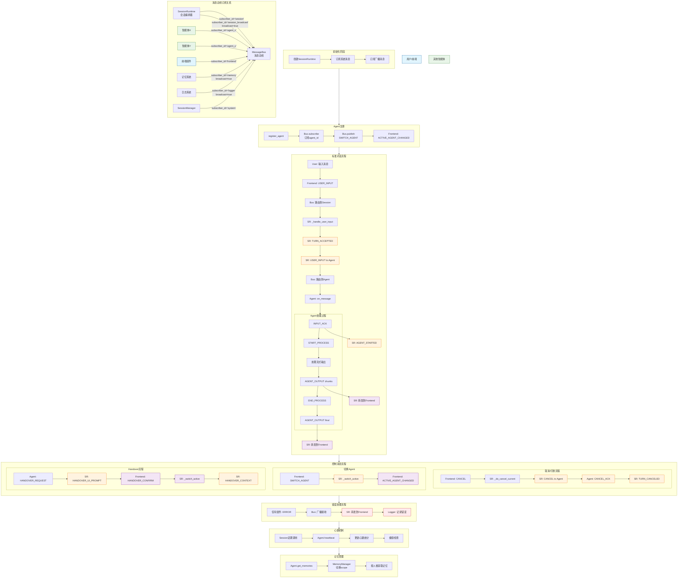

```mermaid
flowchart TD
    %% ========== 组件定义 ==========
    User[用户/前端]
    Frontend[前端组件]
    Bus[MessageBus<br/>消息总线]
    SR[SessionRuntime<br/>会话编排器]
    AgentX[智能体X]
    AgentY[智能体Y]
    Memory[记忆系统]
    SessionMgr[SessionManager]
    Logger[日志系统]
    OtherAgents[其他智能体]
    
    %% ========== 消息流颜色定义 ==========
    classDef userMsg fill:#e1f5fe,stroke:#01579b
    classDef agentMsg fill:#e8f5e8,stroke:#2e7d32
    classDef controlMsg fill:#fff3e0,stroke:#ef6c00
    classDef eventMsg fill:#f3e5f5,stroke:#7b1fa2
    classDef errorMsg fill:#ffebee,stroke:#c62828
    
    %% ========== 初始化阶段 ==========
    subgraph Init[初始化阶段]
        direction LR
        Init1[创建SessionRuntime] --> Init2[订阅系统消息]
        Init2 --> Init3[订阅广播消息]
    end
    
    %% ========== Agent注册流程 ==========
    subgraph Register[Agent注册]
        direction LR
        Reg1[register_agent] --> Reg2[Bus.subscribe<br/>订阅agent_id]
        Reg2 --> Reg3[Bus.publish<br/>SWITCH_AGENT]
        Reg3 --> Reg4[Frontend: ACTIVE_AGENT_CHANGED]
    end
    
    %% ========== 标准对话流程 ==========
    subgraph Conversation[标准对话流程]
        direction TB
        C1[User: 输入消息] --> C2[Frontend: USER_INPUT]
        C2 --> C3[Bus: 路由到Session]
        C3 --> C4[SR: _handle_user_input]
        C4 --> C5[SR: TURN_ACCEPTED]
        C5 --> C6[SR: USER_INPUT to Agent]
        C6 --> C7[Bus: 路由到Agent]
        C7 --> C8[Agent: on_message]
        
        subgraph AgentProcess[Agent处理过程]
            A1[INPUT_ACK] --> A2[START_PROCESS]
            A2 --> A3[处理流式输出]
            A3 --> A4[AGENT_OUTPUT chunks]
            A4 --> A5[END_PROCESS]
            A5 --> A6[AGENT_OUTPUT final]
        end
        
        C8 --> AgentProcess
        A1 --> C9[SR: AGENT_STARTED]
        A4 --> C10[SR: 转发到Frontend]
        A6 --> C11[SR: 转发到Frontend]
    end
    
    %% ========== 控制消息流程 ==========
    subgraph Control[控制消息流程]
        direction TB
        subgraph Cancel[取消/打断流程]
            Can1[Frontend: CANCEL] --> Can2[SR: _do_cancel_current]
            Can2 --> Can3[SR: CANCEL to Agent]
            Can3 --> Can4[Agent: CANCEL_ACK]
            Can4 --> Can5[SR: TURN_CANCELED]
        end
        
        subgraph Switch[切换Agent]
            Sw1[Frontend: SWITCH_AGENT] --> Sw2[SR: _switch_active]
            Sw2 --> Sw3[Frontend: ACTIVE_AGENT_CHANGED]
        end
        
        subgraph Handover[Handover流程]
            H1[Agent: HANDOVER_REQUEST] --> H2[SR: HANDOVER_UI_PROMPT]
            H2 --> H3[Frontend: HANDOVER_CONFIRM]
            H3 --> H4[SR: _switch_active]
            H4 --> H5[SR: HANDOVER_CONTEXT]
        end
    end
    
    %% ========== 错误处理流程 ==========
    subgraph Error[错误处理流程]
        direction LR
        E1[任何组件: ERROR] --> E2[Bus: 广播接收]
        E2 --> E3[SR: 转发到Frontend]
        E3 --> E4[Logger: 记录错误]
    end
    
    %% ========== 心跳机制 ==========
    subgraph Heartbeat[心跳机制]
        direction LR
        HB1[Session定期调用] --> HB2[Agent.heartbeat]
        HB2 --> HB3[更新心跳统计]
        HB3 --> HB4[健康检查]
    end
    
    %% ========== 内存管理 ==========
    subgraph MemoryFlow[记忆管理]
        direction LR
        M1[Agent.get_memories] --> M2[MemoryManager<br/>切换scope]
        M2 --> M3[按人格获取记忆]
    end
    
    %% ========== 主流程图连接 ==========
    Init --> Register
    Register --> Conversation
    Conversation --> Control
    Control --> Error
    Error --> Heartbeat
    Heartbeat --> MemoryFlow
    
    %% ========== 组件订阅关系 ==========
    subgraph Subscriptions[消息总线订阅关系]
        SR -- "subscriber_id='session'" --> Bus
        SR -- "subscriber_id='session_broadcast'<br/>broadcast=true" --> Bus
        AgentX -- "subscriber_id='agent_x'" --> Bus
        AgentY -- "subscriber_id='agent_y'" --> Bus
        Frontend -- "subscriber_id='frontend'" --> Bus
        Memory -- "subscriber_id='memory'<br/>broadcast=true" --> Bus
        Logger -- "subscriber_id='logger'<br/>broadcast=true" --> Bus
        SessionMgr -- "subscriber_id='system'" --> Bus
    end
    
    %% ========== 关键消息类型标注 ==========
    class User,Frontend userMsg
    class AgentX,AgentY,OtherAgents agentMsg
    class C5,C6,C9,Can3,Can4,Can5,Sw2,H2,H5 controlMsg
    class C10,C11,Sw3,H3,H4 eventMsg
    class E3,E4 errorMsg
```

