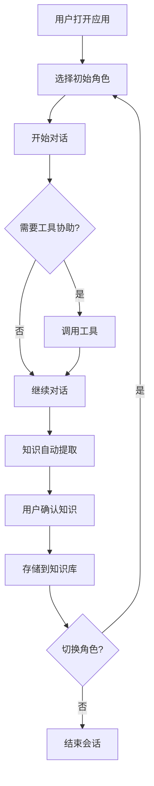

# 政企客户经理智能体交互界面 - H5前端需求规划

## 🎯 项目概述

### 1.1 项目背景
为政企客户经理团队开发一个智能体交互界面，支持角色切换、工具调用和知识反馈功能，提供直观的H5移动端体验。

### 1.2 核心需求
- **角色切换**: 支持4种专业角色的快速切换
- **工具调用**: 集成文件操作、数据分析等常用工具
- **知识反馈**: 自动从对话中提取知识并反馈到知识库
- **响应式设计**: 适配移动端和桌面端

## 📋 功能规格说明

### 2.1 角色管理模块

#### 2.1.1 角色定义
```javascript
const ROLES = {
    senior_manager: {
        id: 'senior_manager',
        name: '高级客户经理',
        avatar: '👤',
        color: '#10b981',
        expertise: ['战略规划', '客户关系', '商务谈判'],
        tools: ['contract_analysis', 'proposal_generation', 'risk_assessment']
    },
    product_expert: {
        id: 'product_expert', 
        name: '产品专家',
        avatar: '🛠️',
        color: '#f59e0b',
        expertise: ['产品功能', '技术方案', '实施细节'],
        tools: ['feature_explanation', 'technical_demo', 'implementation_guide']
    },
    technical_consultant: {
        id: 'technical_consultant',
        name: '技术顾问', 
        avatar: '💻',
        color: '#8b5cf6',
        expertise: ['系统架构', '技术选型', '性能优化'],
        tools: ['architecture_review', 'tech_stack_analysis', 'performance_testing']
    },
    business_specialist: {
        id: 'business_specialist',
        name: '商务专员',
        avatar: '📊',
        color: '#ef4444',
        expertise: ['成本分析', '合同条款', '商务流程'],
        tools: ['cost_calculation', 'contract_review', 'process_optimization']
    }
};
```

#### 2.1.2 角色切换功能
- **切换方式**: 点击角色卡片或滑动切换
- **状态同步**: 实时更新当前活跃角色
- **权限控制**: 根据角色显示对应可用工具
- **视觉反馈**: 高亮当前角色，动画过渡效果

### 2.2 对话交互模块

#### 2.2.1 消息类型定义
```javascript
const MESSAGE_TYPES = {
    USER_MESSAGE: 'user',
    AGENT_MESSAGE: 'agent',
    SYSTEM_MESSAGE: 'system',
    TOOL_CALL: 'tool_call',
    THINKING_CHAIN: 'thinking_chain'
};
```

#### 2.2.2 消息结构
```javascript
{
    id: 'msg_001',
    type: 'agent',
    role: 'senior_manager',
    content: '好的，我来为您制定云迁移方案...',
    timestamp: '2024-12-07T10:31:00Z',
    thinkingChain: [
        {step: 1, action: '分析业务需求', details: '识别关键业务指标'},
        {step: 2, action: '评估技术可行性', details: '检查现有系统兼容性'}
    ],
    toolCalls: [
        {tool: 'proposal_generation', result: '方案生成完成'}
    ]
}
```

### 2.3 工具调用模块

#### 2.3.1 工具分类
```javascript
const TOOL_CATEGORIES = {
    file_operations: {
        name: '文件操作',
        icon: '📁',
        tools: ['read_file', 'write_file', 'analyze_document']
    },
    data_analysis: {
        name: '数据分析', 
        icon: '📊',
        tools: ['calculate', 'statistics', 'chart_generation']
    },
    information_retrieval: {
        name: '信息检索',
        icon: '🔍', 
        tools: ['web_search', 'database_query', 'api_call']
    },
    communication: {
        name: '沟通协作',
        icon: '📧',
        tools: ['email_send', 'notification', 'report_generation']
    }
};
```

#### 2.3.2 工具调用流程
1. **用户触发**: 点击工具按钮或语音指令
2. **权限验证**: 检查当前角色是否有权使用该工具
3. **参数收集**: 弹出参数输入界面（如需要）
4. **执行调用**: 发送API请求到后端服务
5. **结果展示**: 在对话区域显示执行结果

### 2.4 知识反馈模块

#### 2.4.1 知识提取规则
```javascript
const KNOWLEDGE_EXTRACTION_RULES = {
    keywords: ['方案', '策略', '建议', '最佳实践', '经验'],
    patterns: [
        /(?:应该|建议|推荐).{1,20}(?:方案|方法|策略)/g,
        /(?:成功|有效).{1,15}(?:案例|经验)/g,
        /(?:避免|注意).{1,20}(?:问题|风险)/g
    ],
    importanceThreshold: 0.7
};
```

#### 2.4.2 知识反馈流程
1. **实时监控**: 监听对话中的关键词和模式
2. **重要性评估**: 基于上下文和语义分析评分
3. **结构化处理**: 提取实体、关系和标签
4. **用户确认**: 弹出确认对话框让用户审核
5. **存储入库**: 向量化后存入知识库

## 🎨 界面设计规范

### 3.1 整体布局

#### 3.1.1 页面结构
```html
<!-- 移动端布局 -->
<div class="app-container">
    <!-- 头部导航 -->
    <header class="app-header">
        <div class="brand">ADPT-MECH Agent</div>
        <div class="nav-icons">
            <button class="nav-btn">🔔</button>
            <button class="nav-btn">⚙️</button>
        </div>
    </header>
    
    <!-- 角色切换条 -->
    <section class="role-switcher">
        <div class="role-strip">
            <!-- 角色卡片水平排列 -->
        </div>
    </section>
    
    <!-- 主对话区域 -->
    <main class="chat-area">
        <div class="messages-container">
            <!-- 消息列表 -->
        </div>
    </main>
    
    <!-- 工具快捷栏 -->
    <section class="tools-quickbar">
        <!-- 常用工具按钮 -->
    </section>
    
    <!-- 输入区域 -->
    <footer class="input-area">
        <div class="input-container">
            <!-- 多功能输入框 -->
        </div>
    </footer>
</div>
```

#### 3.1.2 响应式断点
```css
/* 移动端优先 */
@media (max-width: 767px) {
    /* 单列布局 */
}

@media (min-width: 768px) and (max-width: 1023px) {
    /* 平板布局 */
}

@media (min-width: 1024px) {
    /* 桌面端布局 */
}
```

### 3.2 组件设计规范

#### 3.2.1 角色卡片组件
```html
<!-- RoleCard.vue -->
<template>
    <div 
        class="role-card" 
        :class="{ active: isActive }"
        @click="switchRole"
    >
        <div class="avatar" :style="{ backgroundColor: role.color }">
            {{ role.avatar }}
            <span class="status" :class="status"></span>
        </div>
        <div class="info">
            <h4>{{ role.name }}</h4>
            <p class="expertise">{{ role.expertise.join(' · ') }}</p>
        </div>
        <button class="switch-btn">切换</button>
    </div>
</template>
```

#### 3.2.2 消息气泡组件
```html
<!-- MessageBubble.vue -->
<template>
    <div class="message" :class="messageType">
        <div class="avatar">{{ avatar }}</div>
        <div class="bubble">
            <div class="header" v-if="showHeader">
                <span class="role-name">{{ roleName }}</span>
                <button 
                    v-if="hasThinkingChain" 
                    class="thinking-toggle"
                    @click="toggleThinkingChain"
                >
                    💭 {{ thinkingChainVisible ? '收起' : '展开' }}
                </button>
            </div>
            <div class="content">
                <p>{{ content }}</p>
                <div v-if="thinkingChainVisible" class="thinking-chain">
                    <!-- 思维链展示 -->
                </div>
                <div v-if="toolCalls.length" class="tool-calls">
                    <!-- 工具调用记录 -->
                </div>
            </div>
            <span class="timestamp">{{ formattedTime }}</span>
        </div>
    </div>
</template>
```

### 3.3 交互动效设计

#### 3.3.1 切换动画
```css
/* 角色切换动画 */
.role-card {
    transition: all 0.3s ease;
    transform: scale(1);
}

.role-card.active {
    transform: scale(1.05);
    box-shadow: 0 4px 12px rgba(0, 0, 0, 0.15);
}

.role-card:hover {
    transform: translateY(-2px);
}
```

#### 3.3.2 消息入场动画
```css
/* 消息入场效果 */
@keyframes messageSlideIn {
    from {
        opacity: 0;
        transform: translateY(20px);
    }
    to {
        opacity: 1;
        transform: translateY(0);
    }
}

.message {
    animation: messageSlideIn 0.3s ease-out;
}
```

## 🔧 技术实现方案

### 4.1 前端技术栈选择

#### 4.1.1 核心框架
```json
{
    "framework": "Vue 3 + TypeScript",
    "state_management": "Pinia",
    "styling": "Tailwind CSS",
    "http_client": "Axios",
    "real_time": "WebSocket",
    "build_tool": "Vite"
}
```

#### 4.1.2 项目结构
```
src/
├── components/          # 可复用组件
│   ├── layout/         # 布局组件
│   ├── chat/           # 聊天相关组件
│   ├── roles/          # 角色相关组件
│   └── tools/          # 工具相关组件
├── stores/             # 状态管理
│   ├── agent.store.ts  # 智能体状态
│   ├── chat.store.ts   # 聊天状态
│   └── tool.store.ts   # 工具状态
├── services/           # API服务
│   ├── api.service.ts  # HTTP请求
│   └── ws.service.ts   # WebSocket
├── types/              # TypeScript类型定义
├── utils/              # 工具函数
└── assets/             # 静态资源
```

### 4.2 数据流设计

#### 4.2.1 状态管理架构
```typescript
// agent.store.ts
interface AgentState {
    currentRole: string;
    availableRoles: Role[];
    agentStatus: 'idle' | 'thinking' | 'responding';
    sessionId: string;
}

// chat.store.ts  
interface ChatState {
    messages: Message[];
    isLoading: boolean;
    hasMore: boolean;
}

// tool.store.ts
interface ToolState {
    availableTools: Tool[];
    activeTool: string | null;
    toolResults: Map<string, any>;
}
```

#### 4.2.2 API接口设计
```typescript
// API服务接口定义
interface AgentAPI {
    // 角色管理
    switchRole(roleId: string): Promise<SwitchResult>;
    getAvailableRoles(): Promise<Role[]>;
    
    // 消息交互
    sendMessage(message: string, sessionId: string): Promise<MessageResponse>;
    getMessageHistory(sessionId: string): Promise<Message[]>;
    
    // 工具调用
    callTool(toolName: string, params: any): Promise<ToolResult>;
    getAvailableTools(roleId: string): Promise<Tool[]>;
    
    // 知识反馈
    extractKnowledge(conversation: Message[]): Promise<KnowledgeItem[]>;
    confirmKnowledge(knowledge: KnowledgeItem): Promise<void>;
}
```

### 4.3 性能优化策略

#### 4.3.1 加载优化
- **代码分割**: 按路由懒加载组件
- **图片优化**: WebP格式，懒加载
- **缓存策略**: Service Worker缓存静态资源

#### 4.3.2 渲染优化
- **虚拟滚动**: 长消息列表使用虚拟滚动
- **防抖节流**: 输入框搜索和滚动事件优化
- **内存管理**: 及时清理无用的事件监听器

## 📱 用户体验设计

### 5.1 交互流程设计

#### 5.1.1 完整用户旅程


#### 5.1.2 异常处理流程
- **网络中断**: 自动重连机制，离线消息队列
- **API错误**: 友好的错误提示和重试选项
- **权限不足**: 清晰的权限申请引导

### 5.2 无障碍设计

#### 5.2.1 键盘导航
```javascript
// 键盘快捷键支持
document.addEventListener('keydown', (e) => {
    // Ctrl+数字键切换角色
    if (e.ctrlKey && e.key >= '1' && e.key <= '4') {
        const roleIndex = parseInt(e.key) - 1;
        switchRole(availableRoles[roleIndex].id);
    }
    
    // Enter发送消息（非组合键时）
    if (e.key === 'Enter' && !e.shiftKey && !e.ctrlKey) {
        e.preventDefault();
        sendMessage();
    }
});
```

#### 5.2.2 屏幕阅读器支持
- **语义化HTML**: 使用正确的ARIA标签
- **焦点管理**: 合理的Tab顺序和焦点指示
- **语音反馈**: 重要的状态变化提供语音提示

## 🚀 开发计划

### 6.1 第一阶段：基础框架（3天）
- [ ] 项目初始化和环境配置
- [ ] 基础布局和组件架构
- [ ] 状态管理和路由配置
- [ ] API服务层实现

### 6.2 第二阶段：核心功能（4天）
- [ ] 角色切换功能实现
- [ ] 消息收发和展示
- [ ] 工具调用界面
- [ ] 基础样式和响应式

### 6.3 第三阶段：高级功能（3天）
- [ ] 知识反馈机制
- [ ] 思维链可视化
- [ ] 性能优化
- [ ] 错误处理和边界情况

### 6.4 第四阶段：测试优化（2天）
- [ ] 单元测试和集成测试
- [ ] 跨浏览器兼容性测试
- [ ] 移动端适配优化
- [ ] 性能基准测试

## 📊 验收标准

### 7.1 功能完整性
- [ ] 角色切换响应时间 < 200ms
- [ ] 消息发送到接收延迟 < 2s
- [ ] 工具调用成功率 > 95%
- [ ] 知识提取准确率 > 80%

### 7.2 性能指标
- [ ] 首屏加载时间 < 3s
- [ ] 核心交互响应时间 < 100ms
- [ ] 内存占用峰值 < 500MB
- [ ] 包体积 < 2MB (gzipped)

### 7.3 用户体验
- [ ] 移动端操作流畅度评分 > 4.5/5
- [ ] 界面易用性用户满意度 > 90%
- [ ] 无障碍功能通过WCAG 2.1 AA标准

---

**文档版本**: v1.0  
**最后更新**: 2024-12-07  
**设计者**: ADPT-MECH UI Team