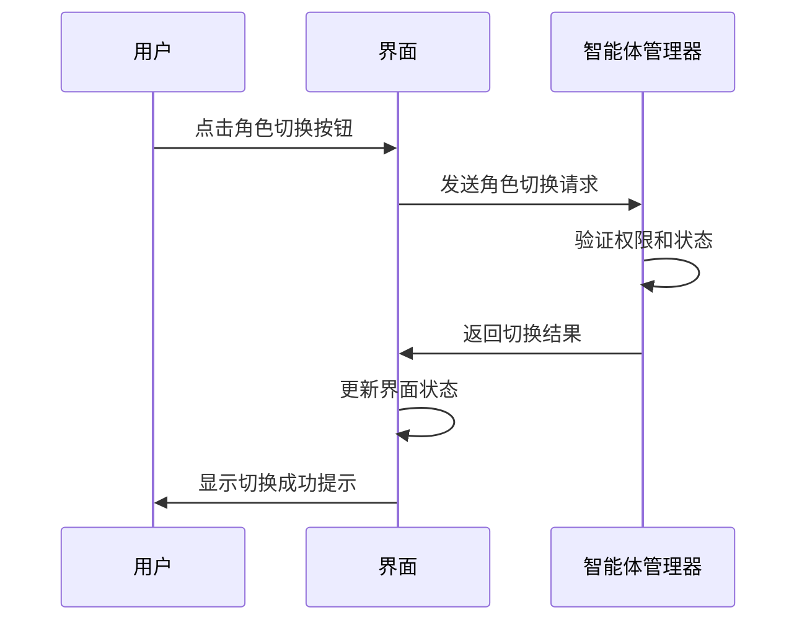
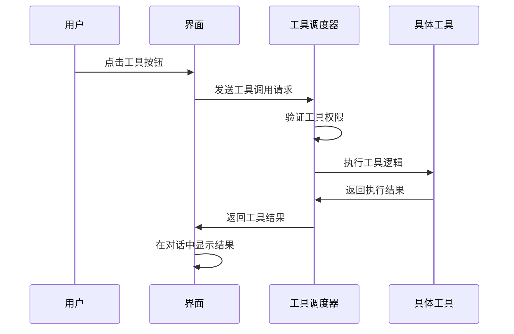
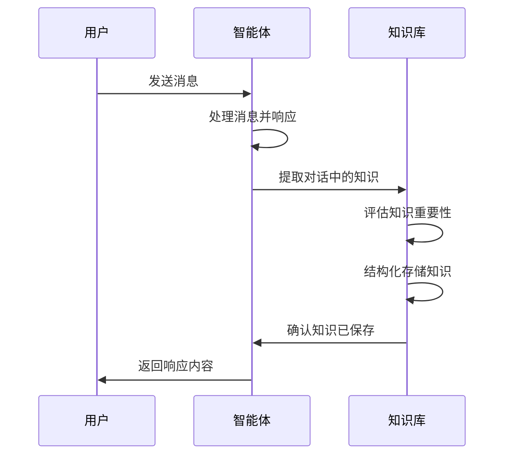

# 政企客户经理智能体交互界面设计

## 🎯 设计目标

为政企客户经理团队提供直观、高效的智能体交互界面，支持角色切换、工具调用和知识反馈功能。

## 🎨 整体布局设计

### 页面结构
```
┌─────────────────────────────────────────────────────────────┐
│                         头部导航栏                           │
├─────────────────────────────────────────────────────────────┤
│                                                             │
│  ┌─────────────┐  ┌─────────────────────────────────────┐  │
│  │             │  │                                     │  │
│  │   侧边栏     │  │           主对话区域                 │  │
│  │  (角色面板)  │  │          (消息展示)                  │  │
│  │             │  │                                     │  │
│  ├─────────────┤  ├─────────────────────────────────────┤  │
│  │             │  │                                     │  │
│  │  工具面板    │  │           输入区域                   │  │
│  │ (工具调用)   │  │          (消息输入)                  │  │
│  │             │  │                                     │  │
│  └─────────────┘  └─────────────────────────────────────┘  │
│                                                             │
└─────────────────────────────────────────────────────────────┘
```

## 📱 核心组件设计

### 1. 角色切换面板 (左侧)

#### 设计要点
- **视觉标识**: 每个角色有独特的头像和颜色主题
- **状态显示**: 在线/忙碌/离线状态指示器
- **快速切换**: 一键切换当前对话角色

#### 角色卡片设计
```html
<div class="role-card active" data-role="senior_manager">
    <div class="role-avatar">
        
        <span class="status-indicator online"></span>
    </div>
    <div class="role-info">
        <h4>李总监</h4>
        <p>高级客户经理</p>
        <div class="expertise-tags">
            <span class="tag">战略规划</span>
            <span class="tag">客户关系</span>
        </div>
    </div>
    <button class="switch-btn">切换</button>
</div>
```

### 2. 主对话区域 (中央)

#### 消息气泡设计
```html
<!-- 用户消息 -->
<div class="message user-message">
    <div class="avatar">👤</div>
    <div class="bubble">
        <p>我们需要一个企业云迁移方案</p>
        <span class="timestamp">10:30</span>
    </div>
</div>

<!-- 智能体消息 -->
<div class="message agent-message">
    <div class="avatar">🤖</div>
    <div class="bubble">
        <div class="agent-header">
            <span class="role-badge">高级客户经理</span>
            <span class="thinking-chain">💭 思维链展开</span>
        </div>
        <p>好的，我来为您制定云迁移方案...</p>
        <div class="tool-call">
            <span class="tool-icon">🔧</span>
            <span>调用了: 方案生成工具</span>
        </div>
        <span class="timestamp">10:31</span>
    </div>
</div>
```

### 3. 工具调用面板 (左下)

#### 工具分类展示
```html
<div class="tools-panel">
    <h4>可用工具</h4>
    
    <!-- 文件操作工具 -->
    <div class="tool-category">
        <h5>📁 文件操作</h5>
        <div class="tool-list">
            <button class="tool-btn" data-tool="read_file">
                📖 读取文件
            </button>
            <button class="tool-btn" data-tool="analyze_document">
                🔍 分析文档
            </button>
        </div>
    </div>
    
    <!-- 数据分析工具 -->
    <div class="tool-category">
        <h5>📊 数据分析</h5>
        <div class="tool-list">
            <button class="tool-btn" data-tool="calculate">
                🧮 计算
            </button>
            <button class="tool-btn" data-tool="generate_chart">
                📈 生成图表
            </button>
        </div>
    </div>
</div>
```

### 4. 输入区域 (右下)

#### 多功能输入框
```html
<div class="input-area">
    <div class="input-toolbar">
        <button class="tool-btn" title="上传文件">📎</button>
        <button class="tool-btn" title="语音输入">🎤</button>
        <button class="tool-btn" title="表情">😊</button>
        <button class="tool-btn" title="知识库搜索">🔍</button>
    </div>
    
    <textarea 
        class="message-input" 
        placeholder="请输入您的问题或需求..."
        rows="3"
    ></textarea>
    
    <div class="input-actions">
        <button class="send-btn">发送</button>
        <button class="clear-btn">清空</button>
    </div>
</div>
```

## 🎨 视觉设计规范

### 色彩方案
```css
:root {
    /* 主色调 */
    --primary-blue: #2563eb;
    --secondary-blue: #3b82f6;
    --accent-blue: #60a5fa;
    
    /* 中性色 */
    --gray-50: #f9fafb;
    --gray-100: #f3f4f6;
    --gray-800: #1f2937;
    
    /* 角色主题色 */
    --role-manager: #10b981;    /* 高级客户经理 - 绿色 */
    --role-expert: #f59e0b;     /* 产品专家 - 橙色 */
    --role-consultant: #8b5cf6; /* 技术顾问 - 紫色 */
    --role-specialist: #ef4444; /* 商务专员 - 红色 */
}
```

### 字体规范
```css
/* 字体家族 */
body {
    font-family: 'PingFang SC', 'Microsoft YaHei', sans-serif;
}

/* 字号规范 */
.role-name { font-size: 16px; font-weight: 600; }
.message-content { font-size: 14px; line-height: 1.5; }
.tool-label { font-size: 12px; }
```

## 🔄 交互流程设计

### 1. 角色切换流程


### 2. 工具调用流程


### 3. 知识反馈流程


## 📱 响应式设计

### 移动端适配
```css
@media (max-width: 768px) {
    .layout-container {
        flex-direction: column;
    }
    
    .sidebar {
        width: 100%;
        height: auto;
    }
    
    .role-cards {
        flex-direction: row;
        overflow-x: auto;
    }
}
```

## 🔧 技术实现建议

### 前端技术栈
- **框架**: Vue 3 + TypeScript
- **样式**: Tailwind CSS
- **状态管理**: Pinia
- **HTTP客户端**: Axios
- **实时通信**: WebSocket

### 组件架构
```
src/
├── components/
│   ├── layout/
│   │   ├── Header.vue
│   │   ├── Sidebar.vue
│   │   └── MainArea.vue
│   ├── chat/
│   │   ├── MessageBubble.vue
│   │   ├── MessageInput.vue
│   │   └── ThinkingChain.vue
│   ├── roles/
│   │   ├── RoleCard.vue
│   │   └── RoleSwitcher.vue
│   └── tools/
│       ├── ToolPanel.vue
│       └── ToolButton.vue
├── stores/
│   ├── agentStore.ts
│   ├── chatStore.ts
│   └── toolStore.ts
└── services/
    ├── apiService.ts
    └── websocketService.ts
```

## 🎯 用户体验优化

### 1. 加载状态优化
- 骨架屏加载动画
- 智能体思考状态指示器
- 渐进式图片加载

### 2. 交互反馈
- 操作成功/失败提示
- 网络状态监测
- 错误边界处理

### 3. 性能优化
- 虚拟滚动（长对话列表）
- 图片懒加载
- API请求缓存

## 📋 验收标准

### 功能完整性
- [ ] 角色切换功能正常
- [ ] 工具调用响应及时
- [ ] 知识反馈机制有效
- [ ] 对话历史可追溯

### 用户体验
- [ ] 界面响应时间 < 200ms
- [ ] 移动端适配良好
- [ ] 操作流程直观易懂
- [ ] 错误处理友好

### 技术指标
- [ ] 首屏加载时间 < 3s
- [ ] API响应时间 < 1s
- [ ] 内存占用合理
- [ ] 代码覆盖率 > 80%

---

**设计版本**: v1.0  
**最后更新**: 2024-12-07  
**设计者**: ADPT-MECH UI Team