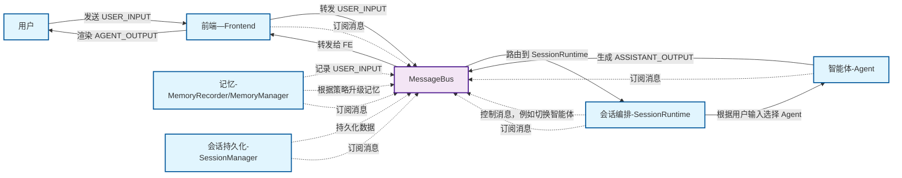
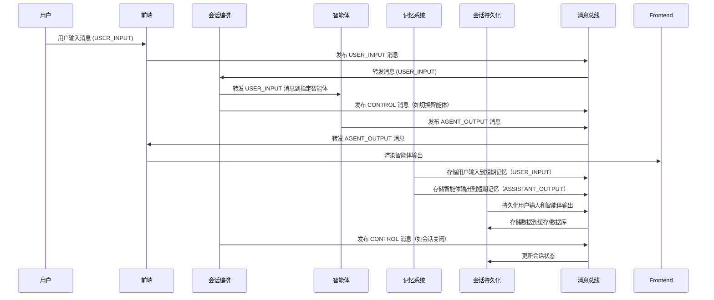

# 事件驱动型智能体会话流程

## **会话流程图**（Component Interaction Flow）

这个图会展示各个组件如何互相通信，包含 **用户**、**前端**、**会话编排（SessionRuntime）**、**智能体（Agent）**、**记忆（MemoryRecorder/MemoryManager）**、**会话持久化（SessionManager）** 等。



## **时序图**（Sequence Diagram）

时序图展示了消息的**发送和处理顺序**，包括各个组件如何接收、处理和响应消息。




## **1️⃣ User（唯一的外部源头）**

**用户角色**：不直接订阅 MessageBus，只通过前端发出消息，消息类型为 **`USER_INPUT`** 或 **`CONTROL`**。

### **发出的消息**：

1. **用户输入消息（`USER_INPUT`）**

   - 用户通过前端提交文本或选择，转化成 **`USER_INPUT`** 消息。

   - **目标**：`SYSTEM` 或 `AGENT`（直接指定智能体时）

   - **消息示例**：

     ```python
     python
     
     
     复制代码
     message = MessageItem(
         session_id="session_123",
         sender_id="user_1",
         sender_type=MessageType.USER,
         target=MessageTarget.SYSTEM,
         payload="What's the weather like today?",
         metadata={"event": "USER_INPUT", "visibility": "frontend", "persist": True}
     )
     ```

2. **用户控制消息（`CONTROL`）**

   - 用户通过 GUI 或交互，发送 **控制消息**，如取消操作、指定智能体、切换 persona 等。

   - **目标**：`SYSTEM` 或 `AGENT`

   - **消息示例**：

     ```python
     python
     
     
     复制代码
     message = MessageItem(
         session_id="session_123",
         sender_id="user_1",
         sender_type=MessageType.USER,
         target=MessageTarget.SYSTEM,
         payload="Switch to agent_2",
         metadata={"event": "CONTROL", "subtype": "SWITCH_AGENT", "visibility": "internal"}
     )
     ```

------

## **2️⃣ 前端（Frontend）**

**前端角色**：订阅 **`broadcast`** 消息，负责渲染 UI，同时可以产生 **`CONTROL`** 消息或 **`USER_INPUT`** 消息。

### **接收的消息**：

1. **智能体输出（`AGENT_OUTPUT`）**

   - 前端接收智能体的回答，渲染 UI 或展示流式数据。

   - **消息类型**：`AGENT_OUTPUT`（改为 `AGENT_OUTPUT`）

   - **目标**：`FRONTEND`（仅前端订阅者）

   - **消息示例**：

     ```python
     python
     
     
     复制代码
     message = MessageItem(
         session_id="session_123",
         sender_id="agent_1",
         sender_type=MessageType.AGENT,
         target=MessageTarget.FRONTEND,
         payload="The weather is sunny today.",
         metadata={"event": "AGENT_OUTPUT", "subtype": "TEXT", "visibility": "frontend", "stream": {"is_chunk": False, "seq": 1, "final": True}}
     )
     ```

### **发出的消息**：

1. **控制消息（`CONTROL`）**

   - 前端收到用户的控制输入，如打断、选择智能体等，生成控制消息。

   - **消息类型**：`CONTROL`

   - **目标**：`SYSTEM` 或 `AGENT`

   - **消息示例**：

     ```python
     python
     
     
     复制代码
     message = MessageItem(
         session_id="session_123",
         sender_id="user_1",
         sender_type=MessageType.USER,
         target=MessageTarget.SYSTEM,
         payload="Cancel the current operation",
         metadata={"event": "CONTROL", "subtype": "CANCEL", "visibility": "internal"}
     )
     ```

2. **用户输入（`USER_INPUT`）**

   - 前端将用户的输入消息转发到 **`SESSION`** 或 **`AGENT`**。

   - **消息类型**：`USER_INPUT`

   - **目标**：`AGENT` 或 `SYSTEM`

   - **消息示例**：

     ```python
     python
     
     
     复制代码
     message = MessageItem(
         session_id="session_123",
         sender_id="user_1",
         sender_type=MessageType.USER,
         target=MessageTarget.AGENT,
         target_id="agent_2",
         payload="Tell me a joke!",
         metadata={"event": "USER_INPUT", "visibility": "both"}
     )
     ```

------

## **3️⃣ Session / SessionRuntime（会话编排）**

**Session/SessionRuntime 角色**：负责整个会话的编排，接收 **`USER_INPUT`**，并做决策（如选择智能体、切换 persona 等），然后转发消息。

### **接收的消息**：

1. **用户输入（`USER_INPUT`）**

   - 会话收到用户输入后，决定路由到哪个 Agent。

   - **消息类型**：`USER_INPUT`

   - **目标**：`AGENT`

   - **消息示例**：

     ```python
     python
     
     
     复制代码
     message = MessageItem(
         session_id="session_123",
         sender_id="user_1",
         sender_type=MessageType.USER,
         target=MessageTarget.AGENT,
         target_id="agent_2",
         payload="What's the capital of France?",
         metadata={"event": "USER_INPUT", "visibility": "both"}
     )
     ```

2. **控制消息（`CONTROL`）**

   - 会话可能发起控制消息，如 `SWITCH_AGENT`、`SET_PERSONA` 等。

   - **消息类型**：`CONTROL`

   - **目标**：`SYSTEM` 或 `AGENT`

   - **消息示例**：

     ```python
     python
     
     
     复制代码
     message = MessageItem(
         session_id="session_123",
         sender_id="system",
         sender_type=MessageType.SYSTEM,
         target=MessageTarget.SYSTEM,
         payload={"new_agent": "agent_2"},
         metadata={"event": "CONTROL", "subtype": "SWITCH_AGENT", "visibility": "internal"}
     )
     ```

### **发出的消息**：

1. **转发消息到 Agent（`USER_INPUT`）**

   - 将用户的输入消息转发给指定的 Agent。

   - **消息类型**：`USER_INPUT`

   - **目标**：`AGENT`

   - **消息示例**：

     ```python
     python
     
     
     复制代码
     message = MessageItem(
         session_id="session_123",
         sender_id="system",
         sender_type=MessageType.SYSTEM,
         target=MessageTarget.AGENT,
         target_id="agent_2",
         payload="What is the capital of France?",
         metadata={"event": "USER_INPUT", "visibility": "both"}
     )
     ```

2. **控制消息（`CONTROL`）**

   - 发出系统级控制消息，如会话结束、选择 Agent 等。

   - **消息类型**：`CONTROL`

   - **目标**：`SYSTEM` 或 `AGENT`

   - **消息示例**：

     ```python
     python
     
     
     复制代码
     message = MessageItem(
         session_id="session_123",
         sender_id="system",
         sender_type=MessageType.SYSTEM,
         target=MessageTarget.SYSTEM,
         payload="Session closed.",
         metadata={"event": "CONTROL", "subtype": "SESSION_CLOSED", "visibility": "internal"}
     )
     ```

------

## **4️⃣ Agent（智能体）**

**Agent 角色**：订阅 **`AGENT`** 目标的消息，处理用户输入，生成输出或调用工具，并可能发回 **`ASSISTANT_OUTPUT`** 或 **`TOOL_CALL`**。

### **接收的消息**：

1. **用户输入（`USER_INPUT`）**

   - Agent 接收用户的输入消息，进行推理或调用工具。

   - **消息类型**：`USER_INPUT`

   - **目标**：`AGENT`

   - **消息示例**：

     ```python
     python
     
     
     复制代码
     message = MessageItem(
         session_id="session_123",
         sender_id="user_1",
         sender_type=MessageType.USER,
         target=MessageTarget.AGENT,
         target_id="agent_2",
         payload="What is the capital of France?",
         metadata={"event": "USER_INPUT", "visibility": "both"}
     )
     ```

### **发出的消息**：

1. **智能体输出（`AGENT_OUTPUT`）**

   - Agent 推理后的结果输出，可能是分片的或完整的回答。

   - **消息类型**：`AGENT_OUTPUT`

   - **目标**：`BROADCAST` 或 `FRONTEND`

   - **消息示例**：

     ```python
     python
     
     
     复制代码
     message = MessageItem(
         session_id="session_123",
         sender_id="agent_2",
         sender_type=MessageType.AGENT,
         target=MessageTarget.FRONTEND,
         payload="The capital of France is Paris.",
         metadata={"event": "AGENT_OUTPUT", "subtype": "TEXT", "visibility": "frontend", "stream": {"is_chunk": False, "seq": 1, "final": True}}
     )
     ```

2. **工具调用（`TOOL_CALL`）**

   - 如果 Agent 调用了工具（如 API），生成 `TOOL_CALL` 消息。

   - **消息类型**：`TOOL_CALL`

   - **目标**：`SYSTEM`

   - **消息示例**：

     ```python
     python
     
     
     复制代码
     message = MessageItem(
         session_id="session_123",
         sender_id="agent_2",
         sender_type=MessageType.AGENT,
         target=MessageTarget.SYSTEM,
         payload={"name": "weather_api", "arguments": {"location": "Paris"}},
         metadata={"event": "TOOL_CALL", "subtype": "weather_api", "visibility": "internal"}
     )
     ```

3. **工具结果（`TOOL_RESULT`）**

   - 工具执行结果返回，Agent 处理并发回消息。

   - **消息类型**：`TOOL_RESULT`

   - **目标**：`SYSTEM`

   - **消息示例**：

     ```python
     python
     
     
     复制代码
     message = MessageItem(
         session_id="session_123",
         sender_id="tool_1",
         sender_type=MessageType.SYSTEM,
         target=MessageTarget.SYSTEM,
         payload={"name": "weather_api", "result": "Sunny"},
         metadata={"event": "TOOL_RESULT", "subtype": "weather_api", "visibility": "internal"}
     )
     ```

------

## **5️⃣ Memory（MemoryRecorder + MemoryManager）**

**Memory 角色**：订阅 **`broadcast`**，主要处理存储和状态的变化，写入短期或长期记忆。

### **接收的消息**：

1. **用户输入（`USER_INPUT`）**

   - 存储用户输入的短期记忆。

   - **消息类型**：`USER_INPUT`

   - **消息示例**：

     ```python
     python
     
     
     复制代码
     message = MessageItem(
         session_id="session_123",
         sender_id="user_1",
         sender_type=MessageType.USER,
         target=MessageTarget.SYSTEM,
         payload="What is the time?",
         metadata={"event": "USER_INPUT", "persist": True}
     )
     ```

2. **智能体输出（`AGENT_OUTPUT`）**

   - 存储智能体输出的最终结果到记忆。

   - **消息类型**：`AGENT_OUTPUT`

   - **消息示例**：

     ```python
     python
     
     
     复制代码
     message = MessageItem(
         session_id="session_123",
         sender_id="agent_1",
         sender_type=MessageType.AGENT,
         target=MessageTarget.SYSTEM,
         payload="The time is 12:00 PM.",
         metadata={"event": "AGENT_OUTPUT", "subtype": "TEXT", "visibility": "internal", "persist": True}
     )
     ```

### **发出的消息**：

1. **控制消息（`CONTROL:MEMORY_PROMOTED`）**

   - 当短期记忆提升为长期记忆时，发出控制消息。

   - **消息类型**：`CONTROL`

   - **消息示例**：

     ```python
     python
     
     
     复制代码
     message = MessageItem(
         session_id="session_123",
         sender_id="system",
         sender_type=MessageType.SYSTEM,
         target=MessageTarget.SYSTEM,
         payload="Promoted 5 memories to long-term.",
         metadata={"event": "CONTROL", "subtype": "MEMORY_PROMOTED", "visibility": "internal"}
     )
     ```

------

## **6️⃣ SessionManager（会话持久化）**

**SessionManager 角色**：管理会话持久化和缓存，通常不订阅总线，而是由 **SessionRuntime** 调用。

### **接收的消息**：

1. **用户输入（`USER_INPUT`）**

   - 会话持久化用户输入，写入数据库或缓存。

   - **消息类型**：`USER_INPUT`

   - **消息示例**：

     ```python
     python
     
     
     复制代码
     message = MessageItem(
         session_id="session_123",
         sender_id="user_1",
         sender_type=MessageType.USER,
         target=MessageTarget.SYSTEM,
         payload="What time is it?",
         metadata={"event": "USER_INPUT", "persist": True}
     )
     ```

2. **智能体输出（`AGENT_OUTPUT`）**

   - 将最终结果写入会话历史。

   - **消息类型**：`AGENT_OUTPUT`

   - **消息示例**：

     ```python
     python
     
     
     复制代码
     message = MessageItem(
         session_id="session_123",
         sender_id="agent_1",
         sender_type=MessageType.AGENT,
         target=MessageTarget.SYSTEM,
         payload="The time is 12:00 PM.",
         metadata={"event": "AGENT_OUTPUT", "subtype": "TEXT", "persist": True}
     )
     ```

------

## 总结：

每个实体的行为都清晰明确，和你现有的系统架构非常契合。整个系统通过 **MessageBus** 传递 **事件驱动消息**，每个组件都可以作为 **消费者** 处理消息并根据需要产生新的消息。