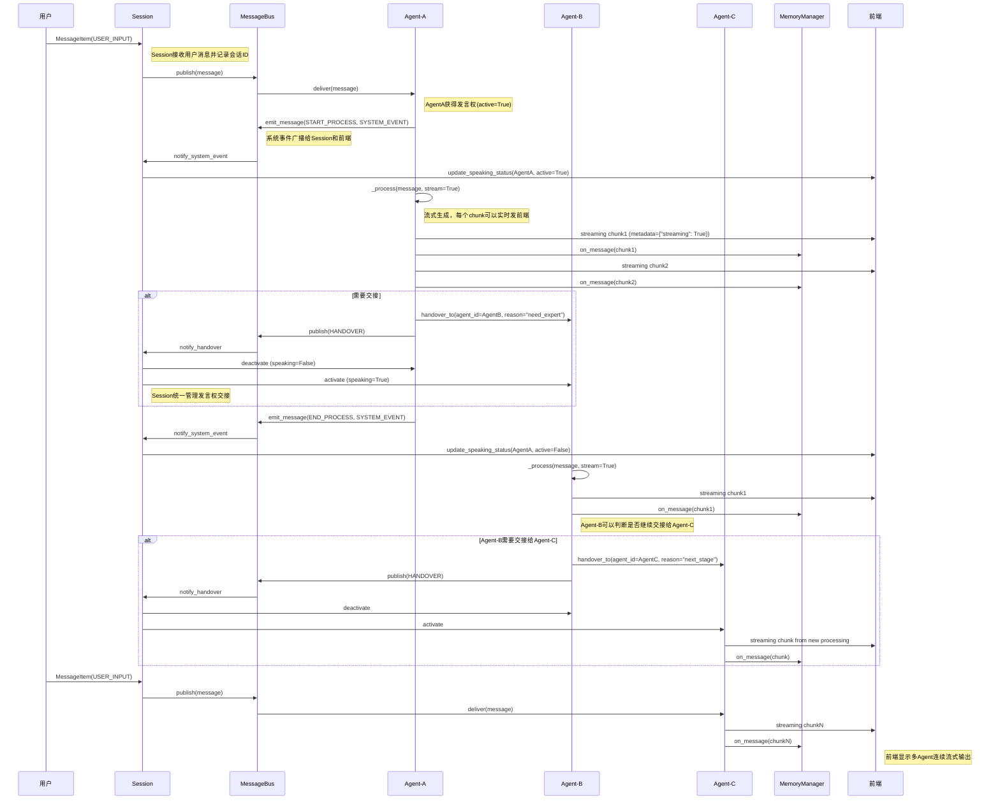

## 多智能体消息交互流程

```mermaid
sequenceDiagram
    participant User as 用户
    participant Session as Session
    participant MB as MessageBus
    participant AgentA as Agent-A
    participant AgentB as Agent-B
    participant AgentC as Agent-C
    participant MM as MemoryManager
    participant FE as 前端

    %% 用户输入
    User->>Session: MessageItem(USER_INPUT)
    Note right of Session: Session接收用户消息并记录会话ID
    Session->>MB: publish(message)

    %% MessageBus 分发给活跃Agent
    MB->>AgentA: deliver(message)
    Note right of AgentA: AgentA获得发言权(active=True)

    %% Agent-A 开始处理，发系统事件
    AgentA->>MB: emit_message(START_PROCESS, SYSTEM_EVENT)
    Note right of MB: 系统事件广播给Session和前端
    MB->>Session: notify_system_event
    Session->>FE: update_speaking_status(AgentA, active=True)

    %% Agent-A 流式生成响应
    AgentA->>AgentA: _process(message, stream=True)
    Note right of AgentA: 流式生成，每个chunk可以实时发前端
    AgentA->>FE: streaming chunk1 (metadata={"streaming": True})
    AgentA->>MM: on_message(chunk1)
    AgentA->>FE: streaming chunk2
    AgentA->>MM: on_message(chunk2)

    %% Agent-A 判断需要交接
    alt 需要交接
        AgentA->>AgentB: handover_to(agent_id=AgentB, reason="need_expert")
        AgentA->>MB: publish(HANDOVER)
        MB->>Session: notify_handover
        Session->>AgentA: deactivate (speaking=False)
        Session->>AgentB: activate (speaking=True)
        Note right of Session: Session统一管理发言权交接
    end

    %% Agent-A 完成处理，发系统结束事件
    AgentA->>MB: emit_message(END_PROCESS, SYSTEM_EVENT)
    MB->>Session: notify_system_event
    Session->>FE: update_speaking_status(AgentA, active=False)

    %% Agent-B 开始处理接收的消息
    AgentB->>AgentB: _process(message, stream=True)
    AgentB->>FE: streaming chunk1
    AgentB->>MM: on_message(chunk1)
    Note right of AgentB: Agent-B可以判断是否继续交接给Agent-C

    alt Agent-B需要交接给Agent-C
        AgentB->>AgentC: handover_to(agent_id=AgentC, reason="next_stage")
        AgentB->>MB: publish(HANDOVER)
        MB->>Session: notify_handover
        Session->>AgentB: deactivate
        Session->>AgentC: activate
        AgentC->>FE: streaming chunk from new processing
        AgentC->>MM: on_message(chunk)
    end

    %% 用户继续提问
    User->>Session: MessageItem(USER_INPUT)
    Session->>MB: publish(message)
    MB->>AgentC: deliver(message)
    AgentC->>FE: streaming chunkN
    AgentC->>MM: on_message(chunkN)
    Note right of FE: 前端显示多Agent连续流式输出

```

